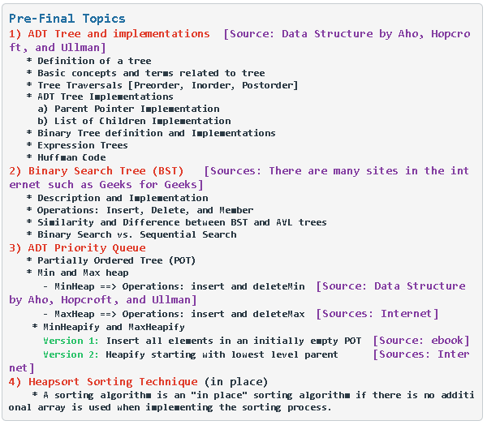
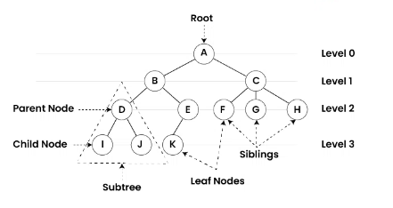

1. Definition of a Tree

- A tree is a finite, non-empty set of nodes with the following properties:
  - A designated node called the root.
  - The remaining nodes (if any) are partitioned into kk ( k≥0k≥0) disjoint subsets, each of which is a tree. These subsets are called the subtrees of the root.

2. Basic Concepts and Terms Related to Trees

- Node: A fundamental unit of a tree.
- Root: The top node in a tree, having no parent.
- Edge: A connection between two nodes, representing a parent-child relationship.
- Parent: A node that has edges pointing to other nodes (its children).
- Child: A node that has an edge from its parent node.
- Leaf: A node with no children.
- Subtree: A tree formed by a node and its descendants.
- Depth of a node: The length of the path from the root to the node.
- Height of a tree: The depth of the deepest leaf node.
- Degree: The number of subtrees or children a node has.

3. Tree Traversals

- Tree traversal refers to the process of visiting each node in a tree in a specific order.
  a. Preorder Traversal

  1.  Visit the root.
  2.  Traverse the left subtree in preorder.
  3.  Traverse the right subtree in preorder.

  b. Inorder Traversal

  1.  Traverse the left subtree in inorder.
  2.  Visit the root.
  3.  Traverse the right subtree in inorder.

  c. Postorder Traversal

  1.  Traverse the left subtree in postorder.
  2.  Traverse the right subtree in postorder.
  3.  Visit the root.

4. ADT Tree Implementations

   - Parent Pointer Implementation

     - In this method, each node contains a pointer to its parent. This allows efficient upward traversal in the tree. However, downward traversal still requires separate child pointers.

   - List of Children Implementation
     - Each node contains a list of pointers to its children. This is a flexible way of representing trees, as nodes can have a variable number of children, with each node storing a list of its children pointers.

5. Binary Tree Definition and Implementations

- A binary tree is a tree in which each node has at most two children, typically referred to as the left and right child.
  - Binary Search Tree (BST): A binary tree where the left child’s value is smaller than the parent, and the right child’s value is larger than the parent. This property applies to all nodes recursively.

Implementations:

- Each node in the binary tree typically contains:
  - A data field.
  - A pointer to the left child.
  - A pointer to the right child.

6. Expression Trees

- An expression tree is a binary tree used to represent arithmetic expressions. Each internal node represents an operator, and each leaf node represents an operand (either a constant or variable).
  - Example:
    Expression: (a+b)×(c−d)(a+b)×(c−d)

7. Huffman Code

- Huffman coding is a compression algorithm that assigns variable-length codes to input characters, with shorter codes assigned to more frequent characters. It is commonly used for data compression.

Steps:

- Build a frequency table of all characters in the input.
- Construct a binary tree called the Huffman tree, where each leaf node corresponds to a character and the path from the root to the leaf defines the character's code.
- Traverse the tree to assign binary codes to each character.
